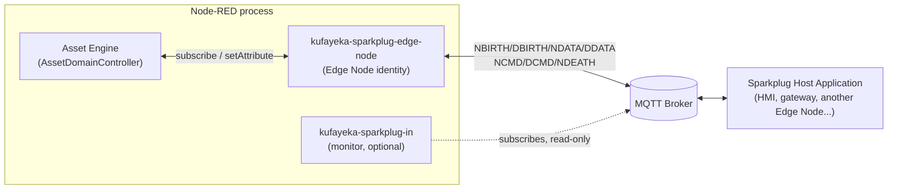
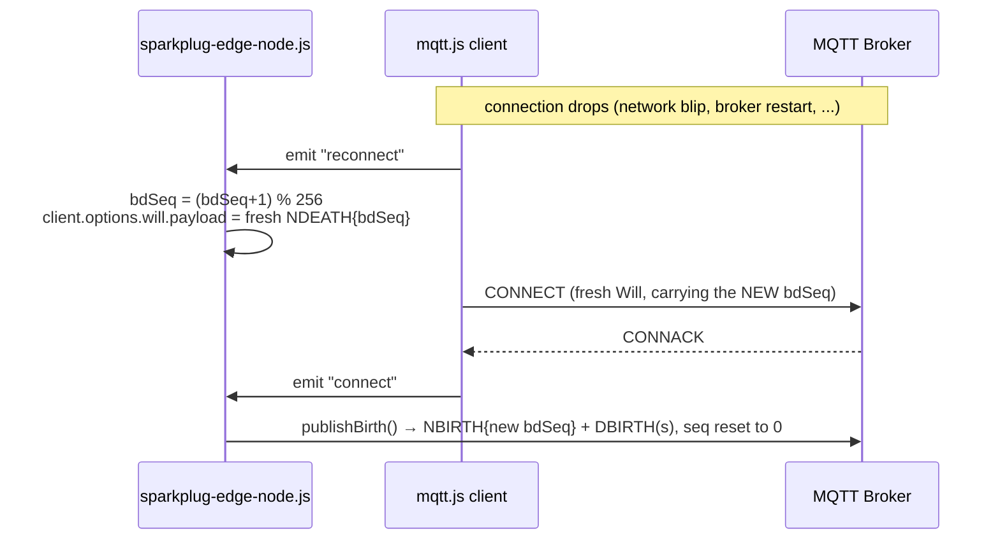
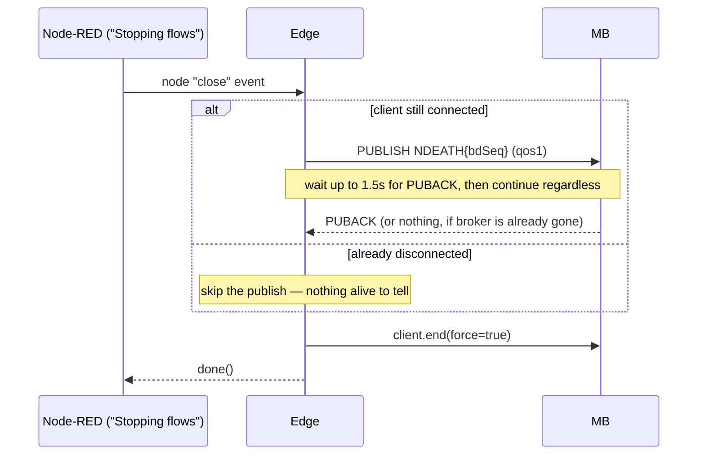
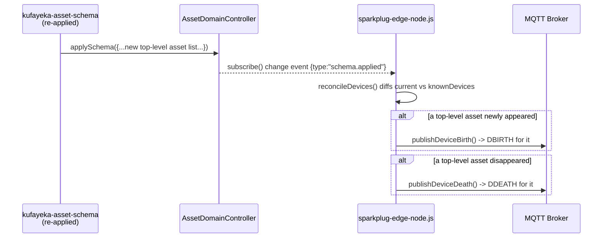

# MQTT Sparkplug B — Asset Engine Integration

This document explains how `@kufayeka/node-red-asset-engine` implements the
[Eclipse Sparkplug B specification, v3.0.0 (2022-11-16)](https://sparkplug.eclipse.org/),
how data actually moves between the asset tree and the MQTT bus, how to
**use** it (set up an Edge Node, trigger births/rebirths, write values back),
and — the part that matters most if you're deciding whether to trust this in
production — **exactly which parts of the spec are implemented, and which
are not**, each backed by the actual spec PDF (section, page, and quoted
text) plus a pointer to the exact source line implementing (or not
implementing) it.

> Every citation below was pulled from the official spec PDF itself
> (`sparkplug-specification-3.0.0.pdf`, 141 pages, downloaded from
> `sparkplug.eclipse.org`) via `pdftotext`, not from memory or a summary.
> Page numbers are the document's own printed page numbers (bottom of page),
> matching its Table of Contents — not the PDF viewer's page count.

---

## 1. Architecture: what role does the Asset Engine play?

Sparkplug B defines a few participant roles (spec §3, "Sparkplug
Architecture and Infrastructure Components", p.15). This plugin implements
exactly one of them:

- **Edge Node** (`kufayeka-sparkplug-edge-node`) — **this is the asset
  engine itself.** Per spec §3.2 (p.16): *"an MQTT Edge Node is any MQTT
  v3.1.1 or v5.0 compliant MQTT Client application that manages an MQTT
  session and provides the physical and/or logical gateway functions..."*
  It owns one Sparkplug identity (`groupId` + `edgeNodeId`), publishes its
  whole asset tree onto the bus, and accepts writes back.
- **Device** — every **top-level asset** in the tree (e.g. `Plant1`) is
  mapped to one Sparkplug Device (spec §3.3, p.16). This was an explicit
  design choice ("Device per top-level asset") over the alternative of one
  Device per leaf asset.
- **Sparkplug Host Application** — **not implemented, and not the goal.**
  This plugin never acts as a Host itself. It can optionally be told about
  one (a "Primary Host ID", §3.7) so it knows to wait for that Host before
  birthing — but it never publishes `STATE`, subscribes broadly, or does
  anything else a real Host does. Any real Host Application (Ignition,
  Chariot, a custom one) can talk to this Edge Node as a normal Sparkplug
  client.
- **Sparkplug In** (`kufayeka-sparkplug-in`) — not a spec role at all, a
  local convenience: a passive listener that decodes whatever Sparkplug
  traffic it sees and flags a subset of structural compliance problems.



---

## 2. Nodes provided

| Node type | Role | File |
|---|---|---|
| `kufayeka-sparkplug-edge-node` | Config node. One MQTT connection, one Sparkplug identity. Publishes the asset tree, applies incoming writes. | [nodes/sparkplug-edge-node.js](nodes/sparkplug-edge-node.js) |
| `kufayeka-sparkplug-status` | Regular node, no inputs/outputs — mirrors an Edge Node's connection status onto a visible canvas box (config nodes have none of their own). | [nodes/sparkplug-status.js](nodes/sparkplug-status.js) |
| `kufayeka-sparkplug-in` | Regular node, its own independent MQTT connection. Subscribes broadly (wildcards), decodes every message, flags compliance issues, emits one `msg` per Sparkplug message seen. | [nodes/sparkplug-in.js](nodes/sparkplug-in.js) |
| `kufayeka-sparkplug-out` | Regular node, its own independent MQTT connection. Publishes NCMD/DCMD — plays the role of a Host Application/gateway writer, so you can test rebirth requests and attribute writes from a flow instead of a hand-written script. | [nodes/sparkplug-out.js](nodes/sparkplug-out.js) |

Shared library code (not nodes):

| File | Purpose |
|---|---|
| [lib/sparkplug/sparkplug_b.proto](lib/sparkplug/sparkplug_b.proto) | The **official**, verbatim Eclipse Tahu `.proto` schema — not hand-rolled. |
| [lib/sparkplug/sparkplugCodec.js](lib/sparkplug/sparkplugCodec.js) | Encode/decode a Sparkplug B protobuf `Payload`, built on `protobufjs` directly (see §10 — why not the `sparkplug-payload` npm package). |
| [lib/sparkplug/sparkplugMapping.js](lib/sparkplug/sparkplugMapping.js) | Pure logic: asset-attribute ⇄ Sparkplug-metric naming and value coercion. |

---

## 3. How data actually moves

### 3.1 Connect → Birth (startup or reconnect)

```mermaid
sequenceDiagram
    participant Edge as Edge Node<br/>(sparkplug-edge-node.js)
    participant MB as MQTT Broker
    participant Host as Host Application<br/>(optional)

    Edge->>MB: CONNECT (clientId="kufayeka-sparkplug-&lt;group&gt;-&lt;edge&gt;",<br/>Will = NDEATH{bdSeq}, qos1)
    MB-->>Edge: CONNACK
    Edge->>MB: PUBLISH spBv1.0/&lt;group&gt;/NBIRTH/&lt;edge&gt;<br/>{bdSeq, "Node Control/Rebirth"=false} (qos0, seq=0)
    loop for each top-level asset ("Device")
        Edge->>MB: PUBLISH spBv1.0/&lt;group&gt;/DBIRTH/&lt;edge&gt;/&lt;device&gt;<br/>{all effective attributes as metrics} (qos0)
    end
    Edge->>MB: SUBSCRIBE spBv1.0/&lt;group&gt;/NCMD/&lt;edge&gt;,<br/>spBv1.0/&lt;group&gt;/DCMD/&lt;edge&gt;/+ (qos1)
    MB-->>Host: forwards NBIRTH/DBIRTH
```

Source: [sparkplug-edge-node.js:214-259](nodes/sparkplug-edge-node.js#L214-L259)
(`connect()`), birth itself in
[publishBirth()](nodes/sparkplug-edge-node.js#L98-L130).

### 3.2 Live attribute change → DDATA

```mermaid
sequenceDiagram
    participant Flow as Any writer<br/>(asset-write node, script, UI)
    participant Engine as AssetDomainController
    participant Edge as sparkplug-edge-node.js
    participant MB as MQTT Broker

    Flow->>Engine: asset.setAttribute("Plant1.Motor1.Speed", 77)
    Engine-->>Edge: subscribe() change event<br/>{path, value, ts, type}
    Edge->>Edge: group changes by top-level asset ("Device")
    Edge->>Edge: toSparkplugMetric() → {name, type, value | isNull}
    Edge->>MB: PUBLISH spBv1.0/&lt;group&gt;/DDATA/&lt;edge&gt;/&lt;device&gt;<br/>{seq++, metrics} (qos0)
```

Source: [onAssetChange()](nodes/sparkplug-edge-node.js#L132-L162), naming via
[sparkplugMapping.js](lib/sparkplug/sparkplugMapping.js) `topLevelNameFromPath`
/ `relativeMetricNameFromPath` / `toSparkplugMetric`.

### 3.3 Incoming write (NCMD / DCMD) → applied to the asset tree

```mermaid
sequenceDiagram
    participant Host as Host / gateway / other client
    participant MB as MQTT Broker
    participant Edge as sparkplug-edge-node.js
    participant Engine as AssetDomainController

    Host->>MB: PUBLISH spBv1.0/&lt;group&gt;/DCMD/&lt;edge&gt;/&lt;device&gt;<br/>{metrics:[{name:"Motor1/Speed", value:123}]}
    MB->>Edge: "message" event
    Edge->>Edge: deviceId + name.split("/").join(".")<br/>→ full dotted asset path
    Edge->>Engine: asset.setAttribute(fullPath, value)<br/>(same entry point as the asset-write node)
    Engine-->>Edge: subscribe() fires again (§3.2)
    Edge->>MB: PUBLISH DDATA confirming the new value
```

NCMD (no device segment) is treated as a *direct dotted path* instead —
`Plant1/Status` → `asset.setAttribute("Plant1.Status", ...)`. Source:
[onMessage()](nodes/sparkplug-edge-node.js#L178-L212),
[applyIncomingMetric()](nodes/sparkplug-edge-node.js#L170-L176).

### 3.4 Reconnect: bdSeq must advance too



Spec basis — §6.4.25 NDEATH (p.92-93): *"[tck-id-payloads-ndeath-bdseq] ...
It is important to note that any new CONNECT packet must increment the
bdSeq number in the payload compared to what was in the previous CONNECT
packet. This ensures that any Host Applications will be able to distinguish
between current and old bdSeq numbers in the event that messages are
delivered out of order. When incrementing the bdSeq number, if the previous
value was 255, the next must be zero."* This says *any* new CONNECT packet,
not just the first one — including ones `mqtt.js` sends silently on its own
auto-reconnect. Source:
[sparkplug-edge-node.js:261-276](nodes/sparkplug-edge-node.js#L261-L276),
confirmed against `mqtt.js`'s own source
(`node_modules/mqtt/build/lib/client.js`, `connectPacket.will` is rebuilt
from `client.options.will` on every CONNECT), regression test in
[test/nodes/sparkplug-edge-node_spec.js](test/nodes/sparkplug-edge-node_spec.js)
("advances bdSeq...").

### 3.5 Rebirth request

```mermaid
sequenceDiagram
    participant Host
    participant MB
    participant Edge

    Host->>MB: PUBLISH spBv1.0/&lt;group&gt;/NCMD/&lt;edge&gt;<br/>{"Node Control/Rebirth"=true}
    MB->>Edge: "message"
    Edge->>Edge: rebirthRequested = true
    Edge->>MB: publishBirth() → fresh NBIRTH + DBIRTH(s)
```

Source: [sparkplug-edge-node.js:192-200](nodes/sparkplug-edge-node.js#L192-L200).
See §7.2 below for how to send this yourself.

### 3.6 Graceful shutdown



Spec basis — §6.4.25 NDEATH (p.92): *"[tck-id-payloads-ndeath-will-message-
publisher] An NDEATH message SHOULD be published by the Edge Node before it
intentionally disconnects from the MQTT Server."* — a SHOULD, not a MUST,
which is why this is allowed to give up after a short grace period rather
than block shutdown forever. Source:
[sparkplug-edge-node.js:291-338](nodes/sparkplug-edge-node.js#L291-L338),
regression test "closes promptly instead of hanging when the broker is
already gone at shutdown time" in
[test/nodes/sparkplug-edge-node_spec.js](test/nodes/sparkplug-edge-node_spec.js).

### 3.7 Optional Primary Host STATE handshake

```mermaid
sequenceDiagram
    participant Edge as sparkplug-edge-node.js
    participant MB as MQTT Broker
    participant Host as Primary Host<br/>(e.g. Ignition)

    Edge->>MB: CONNECT + SUBSCRIBE spBv1.0/STATE/&lt;primaryHostId&gt;
    Note over Edge: waitingForPrimaryHost = true<br/>(no NBIRTH/DBIRTH yet)
    MB-->>Edge: retained STATE {online:true, timestamp} (if Host already up)
    Edge->>Edge: handlePrimaryHostState() confirms online
    Edge->>MB: publishBirth() -> NBIRTH + DBIRTH(s)

    Note over Host,MB: later: Host goes offline
    Host->>MB: STATE {online:false, timestamp}
    MB->>Edge: "message"
    Edge->>MB: publish NDEATH{bdSeq}
    Edge->>Edge: client.end() then connect() again<br/>(re-enters "waiting" state)
```

Only active if a **Primary Host ID** is configured (blank by default — the
Edge Node then births immediately, exactly as in §3.1). Spec §5.4 (p.35-37):
*"Edge Nodes can be configured to support the concept of a Primary Host
Application. In this case, the Edge Node must wait until the Primary Host
Application is online and subscribed to Sparkplug messages before the Edge
Node publishes its NBIRTH and DBIRTH messages... Specifying a Primary Host
is not required for an Edge Node."* And on going offline (p.37):
*"[tck-id-message-flow-edge-node-birth-publish-phid-offline] ... it MUST
immediately publish an NDEATH message and disconnect from the MQTT Server
and start the connection establishment process over."*
Source: [handlePrimaryHostState()](nodes/sparkplug-edge-node.js#L310-L355),
[connect()'s "connect" handler](nodes/sparkplug-edge-node.js#L423-L461).

### 3.8 Dynamic per-Device DBIRTH/DDEATH on a schema change



No reconnect or rebirth request needed — spec §5.6 (p.41): *"A Device can
publish a DBIRTH as long as an NBIRTH has been sent previously and the MQTT
session is active"*, and §6.4.26 DDEATH (p.94): *"If the Edge Node
determines that a device is no longer accessible... the Edge Node should
publish a DDEATH."* "No longer accessible" is interpreted here as "removed
from the deployed schema" — this asset engine has no other notion of an
individual Device going offline independently of the whole Edge Node.
Source: [reconcileDevices()](nodes/sparkplug-edge-node.js#L215-L233),
[publishDeviceDeath()](nodes/sparkplug-edge-node.js#L201-L208).

---

## 4. Topic & payload reference

Per spec §4.1 "Topic Namespace Elements" (p.18): `namespace/group_id/
message_type/edge_node_id/[device_id]`.

| Message | Topic | Direction | Triggered by | QoS |
|---|---|---|---|---|
| NBIRTH | `spBv1.0/<group>/NBIRTH/<edge>` | Edge → bus | connect, reconnect, rebirth request | 0 |
| DBIRTH | `spBv1.0/<group>/DBIRTH/<edge>/<device>` | Edge → bus | same as NBIRTH, once per top-level asset | 0 |
| DDATA | `spBv1.0/<group>/DDATA/<edge>/<device>` | Edge → bus | any asset attribute change under that Device | 0 |
| NDEATH | `spBv1.0/<group>/NDEATH/<edge>` | Edge → bus | MQTT Will (ungraceful) or explicit publish on clean shutdown | 1 |
| NCMD | `spBv1.0/<group>/NCMD/<edge>` | bus → Edge | Host/gateway writing a node-scoped attribute, or requesting rebirth | 1 (subscribe) |
| DCMD | `spBv1.0/<group>/DCMD/<edge>/<device>` | bus → Edge | Host/gateway writing a device-scoped attribute | 1 (subscribe) |
| NDATA | *(not published)* | — | this Edge Node has no node-scoped (non-Device) metrics to report | — |
| DDEATH | `spBv1.0/<group>/DDEATH/<edge>/<device>` | Edge → bus | a top-level asset removed from the schema at runtime (§3.8) | 0 |
| STATE | `spBv1.0/STATE/<primaryHostId>` | bus → Edge (subscribe only) | only if a Primary Host ID is configured — Edge Node never publishes to STATE itself (that's Host-only, §8 gap) | 1 (subscribe) |

**Payload shape** (after `sparkplugCodec.decodePayload`):

```jsonc
{
  "timestamp": 1736000000000,
  "seq": 3,                 // 0-255, absent on NDEATH
  "metrics": [
    { "name": "Motor1/Speed", "type": "Double", "value": 77, "timestamp": 1736000000000 },
    { "name": "Motor1/Status", "type": "String", "value": null, "isNull": true }
  ]
}
```

---

## 5. Asset tree ⇄ Sparkplug mapping

- **Device** = one top-level asset (`Plant1`). Everything nested under it
  becomes that Device's metrics.
- **Metric name** = the dotted path *relative to the Device*, with dots
  turned into slashes: `Plant1.Line1.Motor1.Speed` → Device `Plant1`,
  metric `Line1/Motor1/Speed`.
- **Value type**: `boolean→Boolean`, `number→Double`, everything else
  (`string`/`array`/`object`) → `String` (array/object are JSON-stringified
  first). See
  [sparkplugMapping.js:11-24](lib/sparkplug/sparkplugMapping.js#L11-L24).
- **This exact naming scheme is used on both sides** — DBIRTH's
  `collectDeviceMetrics()` and DDATA's `onAssetChange()` both go through
  `relativeMetricNameFromPath`/`topLevelNameFromPath`, so a later DDATA for
  an attribute always uses the identical metric name its DBIRTH used —
  asserted directly by *"a DDATA change on the SAME nested attribute
  computes the IDENTICAL metric name DBIRTH used"* in
  [test/lib/sparkplugMapping_spec.js](test/lib/sparkplugMapping_spec.js).

---

## 6. Sparkplug In — monitor node

`kufayeka-sparkplug-in` ([nodes/sparkplug-in.js](nodes/sparkplug-in.js)) is a
read-only debugging aid, not a spec role. It emits one `msg` per Sparkplug
message it sees:

```jsonc
{
  "topic": "spBv1.0/TestGroup/DDATA/Edge1/Plant1",
  "payload": { "timestamp": 1736000000000, "seq": 4, "metrics": [ /* ... */ ] },
  "sparkplug": { "namespace": "spBv1.0", "groupId": "TestGroup", "messageType": "DDATA", "edgeNodeId": "Edge1", "deviceId": "Plant1" },
  "complianceIssues": []   // non-empty = something below was violated
}
```

`complianceIssues` is a **small, honest subset** of the spec — see
`checkCompliance()` at [sparkplug-in.js:29-88](nodes/sparkplug-in.js#L29-L88):

- NBIRTH missing `bdSeq` or `Node Control/Rebirth`
- a BIRTH message whose `seq` isn't reset to `0`
- a `seq` gap for a given edge node (possible lost/reordered message)
- duplicate or empty metric names within one payload
- a missing top-level `timestamp`
- a payload that fails to decode as a Sparkplug B protobuf at all

Its `seq` checks correctly distinguish every message type per spec
§6.4.5/§6.4.23-26 (p.66-67, p.91-94): NDEATH/NCMD/DCMD **must not** carry a
`seq` (flagged if present), while NBIRTH/DBIRTH/NDATA/DDATA/DDEATH **must**
(flagged if missing, and checked for continuity) — see
[checkCompliance()](nodes/sparkplug-in.js#L29-L92).

It is **not** a TCK (Technology Compatibility Kit) implementation — it
doesn't check the STATE/Primary Host handshake, DataSet/Template metrics,
aliasing, or the full DataType matrix.

---

## 7. Practical usage guide

### 7.1 Setting up an Edge Node

1. Drag a **`kufayeka-sparkplug-status`** node onto any flow tab (it's the
   only way to create/see the config node — Node-RED never shows config
   nodes in the palette directly, exactly like core's "mqtt in"/"mqtt out"
   nodes are what let you create an "mqtt-broker" config).
2. Open it, and under **Edge Node**, choose *"Add new..."*. Fill in:
   - **Broker URL** — e.g. `mqtt://localhost:1883`.
   - **Username / Password** — optional, only if your broker requires auth.
   - **Group ID** — a logical grouping for your edge nodes (default
     `Kufayeka`). Per spec §4.1.2 (p.18-19): *"The format of the Group ID
     MUST be a valid UTF-8 string with the exception of the reserved
     characters of + (plus), / (forward slash), and # (number sign)."*
     This is now validated at deploy time — an invalid character makes the
     node refuse to connect with a clear error, rather than silently
     producing a broken topic.
   - **Edge Node ID** — must be unique for this Group ID across your whole
     MQTT infrastructure (spec §4.1.4, p.19: *"The group_id combined with
     the edge_node_id element MUST be unique from any other
     group_id/edge_node_id assigned in the MQTT infrastructure."*), same
     character restriction and validation as Group ID.
   - **Primary Host ID** — optional (§3.7). Leave blank unless you want this
     Edge Node to wait for a specific Host Application (e.g. Ignition) to be
     online before birthing.
3. Deploy. On deploy, the node connects and immediately publishes NBIRTH +
   one DBIRTH per top-level asset (§3.1) — unless a Primary Host ID is
   configured, in which case it waits for that Host's STATE first (§3.7).
   The `kufayeka-sparkplug-status` node's box shows live connection status
   (`connecting` → `waiting for primary host "..."` (if configured) →
   `online (N devices)` → `disconnected`/`reconnecting` if the connection
   drops).
4. That's it — every asset attribute write from anywhere in Node-RED
   (an `asset-write` node, a calculation script, another flow) is now also
   published as Sparkplug DDATA automatically (§3.2), and adding/removing a
   top-level asset via a schema re-apply automatically DBIRTHs/DDEATHs it
   (§3.8). Nothing else to wire.

### 7.2 How NBIRTH/DBIRTH get triggered

There is no manual "trigger birth" button — it happens automatically in
exactly three situations (§3.1, §3.4, §3.5):

1. **On deploy / Node-RED startup** — the very first `connect()`.
2. **On any underlying MQTT reconnect** — network blip, broker restart,
   anything that drops and re-establishes the session.
3. **On a rebirth request** — someone publishes an NCMD to
   `spBv1.0/<group>/NCMD/<edge>` with a metric named exactly
   `Node Control/Rebirth`, type `Boolean`, value `true`. This is the
   standard Sparkplug mechanism (spec §6.4.19/§4.2.1, p.22: *"The Node
   Control/Rebirth metric is used by Host Application(s) to request a new
   NBIRTH and DBIRTH(s) from an Edge Node."*).

**To trigger it yourself right now**, without a real Host Application, drop
a **`kufayeka-sparkplug-out`** node ([nodes/sparkplug-out.js](nodes/sparkplug-out.js))
on a flow, point it at the same broker with this Edge Node's Group ID/Edge
Node ID as its defaults (or override per-message via `msg.sparkplug`), wire
an `inject` node into it with `msg.command = "rebirth"`, and deploy:

```jsonc
// what the inject node's msg looks like
{ "command": "rebirth" }
```

`kufayeka-sparkplug-out` always publishes at QoS 0 with a valid Sparkplug B
protobuf payload — raw `mosquitto_pub` can't easily produce one by hand,
which is exactly the gap this node fills. Deploy it, fire the inject, then
watch the `kufayeka-sparkplug-status` node's box, or your
`kufayeka-sparkplug-in` monitor's output — you'll see a fresh NBIRTH + one
DBIRTH per device appear immediately.

### 7.3 Available "commands" (writing values back)

There is no separate list of "supported commands" beyond the one mandatory
control metric — everything else is just a normal attribute write, routed
through whichever topic scope matches where that attribute lives. Use
**`kufayeka-sparkplug-out`** for all of these:

| What you want to do | `msg` shape | Topic it publishes to |
|---|---|---|
| Request a full rebirth | `{ command: "rebirth" }` | `spBv1.0/<group>/NCMD/<edge>` |
| Write an attribute on a top-level asset itself | `{ payload: { name: "Plant1/Status", type: "String", value: "MAINTENANCE" } }` (no Device ID configured/given) | `spBv1.0/<group>/NCMD/<edge>` — metric name IS the full dotted path |
| Write an attribute nested under a Device | `{ metrics: [{ name: "Motor1/Speed", type: "Double", value: 123 }] }` (Device ID = `Plant1` configured/given) | `spBv1.0/<group>/DCMD/<edge>/Plant1` — metric name relative to that Device |

All three go through `asset.setAttribute(...)` on the Edge Node side — the
exact same entry point the internal `asset-write` node uses
([sparkplug-edge-node.js:276-282](nodes/sparkplug-edge-node.js#L276-L282)),
so there's no separate/parallel write logic to keep in sync. See
[nodes/sparkplug-out.html](nodes/sparkplug-out.html) for the full `msg`
contract (per-message target override via `msg.sparkplug`, etc.).

A real Sparkplug Host Application (Ignition, Chariot, a custom one) already
knows how to do this on its own — `kufayeka-sparkplug-out` exists so you can
test the write path without standing up a full Host Application first.

### 7.4 Monitoring what's on the bus

Drop a **`kufayeka-sparkplug-in`** node anywhere, point it at your broker,
leave Group ID / Edge Node ID as `+` to watch everything, wire its output
to a `debug` node, and deploy. Every NBIRTH/DBIRTH/NDATA/DDATA/NCMD/DCMD/
NDEATH/DDEATH message on the bus becomes one `msg`, decoded, with
`msg.complianceIssues` flagging anything wrong per §6.

---

## 8. Compliance

### 8.1 Status summary

| # | Requirement | Status |
|---|---|:---:|
| 1 | Topic namespace `spBv1.0/group/type/edge[/device]` | ✅ Compliant |
| 2 | NBIRTH resets `seq` to `0` | ✅ Compliant |
| 3 | NBIRTH carries mandatory `bdSeq` metric | ✅ Compliant |
| 4 | NBIRTH carries mandatory `Node Control/Rebirth` (Boolean, false) metric | ✅ Compliant |
| 5 | NBIRTH/DBIRTH/DDATA published at QoS 0, retain false | ✅ Compliant |
| 6 | `bdSeq` is a wrapping single-byte counter (0-255) | ✅ Compliant |
| 7 | `bdSeq` advances on every new MQTT session, incl. underlying auto-reconnects | ✅ Compliant |
| 8 | `seq` MUST NOT appear on NCMD/DCMD/NDEATH; MUST appear (and continually increment) on NBIRTH/DBIRTH/NDATA/DDATA/DDEATH | ✅ Compliant |
| 9 | `is_null` metrics omit the value field entirely | ✅ Compliant |
| 10 | Rebirth request (NCMD `Node Control/Rebirth`=true) triggers a fresh NBIRTH+DBIRTH | ✅ Compliant |
| 11 | DDATA metric names exactly match the names their DBIRTH declared | ✅ Compliant |
| 12 | Group ID / Edge Node ID / Device ID character-set validation (reject `+`, `/`, `#`) | ✅ Compliant |
| 13 | NDEATH registered as Will (qos1, retain false) + published gracefully on clean shutdown, correlated via `bdSeq` | ✅ Compliant |
| 14 | Incoming NCMD/DCMD writes apply through the one real write path | ✅ Compliant |
| 15 | Malformed/undecodable incoming payloads don't crash the node | ✅ Compliant |
| 16 | **STATE topic / Primary Host Application handshake** (optional, opt-in) | ✅ Compliant |
| 17 | **Per-Device Death (DDEATH)** | ✅ Compliant |
| 18 | **Dynamic DBIRTH** for an asset added after initial connect, without a restart | ✅ Compliant |
| 19 | Full Sparkplug DataType matrix | ⚠️ Partial |
| 20 | **Metric aliasing** | ❌ Not implemented |

**Legend:** ✅ Compliant · ⚠️ Partial · ❌ Not implemented

### 8.2 Detail, per item — spec text + code evidence

**#1 — Topic namespace.** Spec §4.1 "Topic Namespace Elements" (p.18):
`namespace/group_id/message_type/edge_node_id/[device_id]`.
Code: [sparkplug-edge-node.js:86-89](nodes/sparkplug-edge-node.js#L86-L89) builds every topic this way; [sparkplug-in.js:127-132](nodes/sparkplug-in.js#L127-L132) parses it back the same way.

**#2 — NBIRTH seq=0.** Spec §4.2.1 Edge Node (p.21): *"[tck-id-topics-nbirth-seq-num] The NBIRTH MUST include a sequence number in the payload and it MUST have a value of 0."*
Code: [sparkplug-edge-node.js:99](nodes/sparkplug-edge-node.js#L99) `seq = 0;` before calling `nextSeq()`.

**#3 — NBIRTH bdSeq metric.** Spec §4.2.1 (p.21-22): *"[tck-id-topics-nbirth-bdseq-included] A bdSeq number as a metric MUST be included in the payload."* and *"[tck-id-topics-nbirth-bdseq-matching] This MUST match the bdSeq number provided in the MQTT CONNECT packet's Will Message payload."*
Code: [sparkplug-edge-node.js:104](nodes/sparkplug-edge-node.js#L104), same `bdSeq` variable used in the Will at [:234](nodes/sparkplug-edge-node.js#L234).

**#4 — Node Control/Rebirth mandatory metric.** Spec §4.2.1 (p.22): *"[tck-id-topics-nbirth-rebirth-metric] The NBIRTH message MUST include a metric with the name Node Control/Rebirth. It MUST be of datatype boolean and have a value of false."*
Code: [sparkplug-edge-node.js:111](nodes/sparkplug-edge-node.js#L111).

**#5 — QoS 0 / retain false for NBIRTH/DBIRTH/DDATA.** Spec §6.4.19 NBIRTH (p.83): *"[tck-id-payloads-nbirth-qos] NBIRTH messages MUST be published with the MQTT QoS set to 0."* Spec §6.4.20 DBIRTH (p.86): *"[tck-id-payloads-dbirth-qos] DBIRTH messages MUST be published with the MQTT QoS set to 0."* Spec §6.4.22 DDATA (p.90): *"[tck-id-payloads-ddata-qos] DDATA messages MUST be published with the MQTT QoS set to 0."*
Code: [sparkplug-edge-node.js:117,127,151](nodes/sparkplug-edge-node.js#L117) — all three `client.publish(..., {qos:0, retain:false})`.

**#6/#7 — bdSeq wraps at 255, advances every session.** Spec §6.4.25 NDEATH (p.92-93): *"any new CONNECT packet must increment the bdSeq number in the payload compared to what was in the previous CONNECT packet... When incrementing the bdSeq number, if the previous value was 255, the next must be zero."*
Code: connect-time bump at [sparkplug-edge-node.js:220](nodes/sparkplug-edge-node.js#L220), reconnect-time bump at [:273](nodes/sparkplug-edge-node.js#L273), both `(bdSeq + 1) % 256`. Regression test asserts the Will payload actually changes across a simulated reconnect.

**#8 — seq presence/absence rules.** Spec §6.4.5 Payload (p.66-67): *"[tck-id-payloads-sequence-num-always-included] A sequence number MUST be included in the payload of every Sparkplug MQTT message from an Edge Node except NDEATH messages."* and *"[tck-id-payloads-sequence-num-incrementing] All subsequent messages... MUST contain a sequence number that is continually increasing by one... until a value of 255 is reached. At that point, the sequence number of the following message MUST be zero."* Also explicit per-type rules: NCMD/DCMD *"MUST NOT include a sequence number"* (§6.4.23/24, p.91), NDEATH *"MUST NOT include a sequence number"* (§6.4.25, p.92), DDEATH *"MUST include a sequence number"* (§6.4.26, p.94).
Code: the Edge Node's own shared counter at [sparkplug-edge-node.js:77-82](nodes/sparkplug-edge-node.js#L77-L82) is used for NBIRTH/DBIRTH/DDATA/DDEATH (never on NCMD/DCMD, which it doesn't publish, nor on NDEATH's `deathPayloadBuffer()` at [:133-138](nodes/sparkplug-edge-node.js#L133-L138), which correctly omits `seq`). The **monitor's** checker now matches this exactly — NDEATH/NCMD/DCMD flagged if `seq` is present, NBIRTH/DBIRTH/NDATA/DDATA/DDEATH flagged if it's missing or discontinuous — see [checkCompliance()](nodes/sparkplug-in.js#L29-L92), fixed from an earlier version that incorrectly grouped NDEATH and DDEATH together.

**#9 — is_null.** Spec §5.16 Data Publish (p.55): *"[tck-id-operational-behavior-data-publish-nbirth-values] For each metric in the NBIRTH, the value MUST be set to the current value or if the current value is null, the is_null flag MUST be set to true and MUST NOT have a value specified."* (same rule restated for DBIRTH immediately after, p.55-56).
Code: [sparkplugCodec.js:51-54](lib/sparkplug/sparkplugCodec.js#L51-L54) (`encodeMetric` omits the value field when `isNull`), [:81-83](lib/sparkplug/sparkplugCodec.js#L81-L83) (`decodeMetric` mirrors it), [sparkplugMapping.js:42-49](lib/sparkplug/sparkplugMapping.js#L42-L49) (checks null/undefined *before* coercion, so a real `0`/`false`/`""` is never mistaken for "no value").

**#10 — Rebirth request handling.** Spec §4.2.1 (p.22): *"The Node Control/Rebirth metric is used by Host Application(s) to request a new NBIRTH and DBIRTH(s) from an Edge Node."*
Code: [sparkplug-edge-node.js:196-200](nodes/sparkplug-edge-node.js#L196-L200).

**#11 — DBIRTH/DDATA metric name consistency.** Not a single quotable spec sentence — it's the load-bearing assumption behind the whole Report-by-Exception model (§2.2, p.12) and every Host-side correlation rule in §5. Enforced here structurally: both `collectDeviceMetrics()` (birth) and `onAssetChange()` (data) route through the same [sparkplugMapping.js](lib/sparkplug/sparkplugMapping.js) naming helpers — asserted by a dedicated test rather than by inspection alone.

**#12 — ID character validation.** Spec §4.1.2 group_id (p.18-19): *"[tck-id-topic-structure-namespace-valid-group-id] The format of the Group ID MUST be a valid UTF-8 string with the exception of the reserved characters of + (plus), / (forward slash), and # (number sign)."* Identical wording for `edge_node_id` at §4.1.4 (p.19).
Code: [invalidSparkplugIdReason()](nodes/sparkplug-edge-node.js#L13-L27) checked for Group ID/Edge Node ID at deploy time — [sparkplug-edge-node.js:491-501](nodes/sparkplug-edge-node.js#L491-L501) refuses to connect at all on a violation, rather than producing a broken topic. Device ID (a live asset name, not a fixed config field) is checked per-publish in [publishDeviceBirth()](nodes/sparkplug-edge-node.js#L177-L192) — a warning rather than a refusal, since an already-malformed asset name shouldn't newly break a deploy that previously "worked" (just badly).

**#13 — NDEATH / Will correlation.** Spec §6.4.25 NDEATH (p.92): *"[tck-id-payloads-ndeath-will-message-qos] The NDEATH message MUST set the MQTT Will QoS to 1..."*, *"[tck-id-payloads-ndeath-will-message-retain] ...MUST set the MQTT Will Retained flag to false..."*, *"[tck-id-payloads-ndeath-will-message-publisher] An NDEATH message SHOULD be published by the Edge Node before it intentionally disconnects."*
Code: Will registered at [sparkplug-edge-node.js:232-237](nodes/sparkplug-edge-node.js#L232-L237) (`qos:1, retain:false`); graceful publish on close at [:334](nodes/sparkplug-edge-node.js#L334); both derive from the same [deathPayloadBuffer()](nodes/sparkplug-edge-node.js#L91-L96) reading the current `bdSeq`.

**#14 — Write-back through the real path.** No single spec citation (this is an implementation-quality property, not a wire-format rule) — but it's the property that keeps §11 true for incoming writes too. Code: [sparkplug-edge-node.js:170-176](nodes/sparkplug-edge-node.js#L170-L176) calls `asset.setAttribute` directly, the same entry point `nodes/asset-write.js` uses.

**#15 — Decode-failure resilience.** No spec citation (defensive coding, not a normative requirement). Code: try/catch in [onMessage()](nodes/sparkplug-edge-node.js#L184-L189) and [sparkplug-in.js:143-156](nodes/sparkplug-in.js#L143-L156).

**#16 — STATE / Primary Host handshake.** Spec §5.4 (p.35-37): *"Edge Nodes can be configured to support the concept of a Primary Host Application. In this case, the Edge Node must wait until the Primary Host Application is online and subscribed to Sparkplug messages before the Edge Node publishes its NBIRTH and DBIRTH messages... Specifying a Primary Host is not required."* And on going offline: *"[tck-id-message-flow-edge-node-birth-publish-phid-offline] ...it MUST immediately publish an NDEATH message and disconnect from the MQTT Server and start the connection establishment process over."*
Code: optional `primaryHostId` config ([sparkplug-edge-node.js:61-66](nodes/sparkplug-edge-node.js#L61-L66)); deferred birth + STATE subscribe in the `"connect"` handler ([:423-461](nodes/sparkplug-edge-node.js#L423-L461)); the online/offline state machine, including timestamp-based staleness rejection and the NDEATH+restart, in [handlePrimaryHostState()](nodes/sparkplug-edge-node.js#L310-L355). Blank (the default) preserves the original always-birth-immediately behavior exactly — this is opt-in, matching the spec's own "not required."

**#17 — Per-Device Death (DDEATH).** Spec §6.4.26 DDEATH (p.94): *"The DDEATH messages are published by an Edge Node on behalf of an attached device. If the Edge Node determines that a device is no longer accessible (i.e. it has turned off, stopped responding, etc.) the Edge Node should publish a DDEATH..."* and *"[tck-id-payloads-ddeath-seq] Every DDEATH message MUST include a sequence number."*
Code: [publishDeviceDeath()](nodes/sparkplug-edge-node.js#L201-L208) — topic, empty metrics, and a `seq` drawn from the same shared counter as everything else. "No longer accessible" is interpreted as "removed from the deployed asset schema" (see #18's `reconcileDevices()`), since this asset engine has no other notion of an individual Device going offline independently of the whole Edge Node.

**#18 — Dynamic DBIRTH for runtime-added assets.** Spec §5.6 Device Session Establishment (p.41): *"A Device can publish a DBIRTH as long as an NBIRTH has been sent previously and the MQTT session is active."* — the spec explicitly expects a Device to be able to birth mid-session, not only at Edge Node startup.
Code: [reconcileDevices()](nodes/sparkplug-edge-node.js#L215-L233) diffs the current top-level asset list against `knownDevices` on every `"schema.applied"` change event (wired in [onAssetChange()](nodes/sparkplug-edge-node.js#L235-L239)) — a newly-appeared asset gets an immediate `publishDeviceBirth()`, no reconnect or rebirth request needed.

**#19 — Full DataType matrix — Partial, and here's what closing it actually requires.** Spec §6.4.16 Data Types (p.76) defines the full enum: `Int8/16/32/64`, `UInt8/16/32/64`, `Float`, `Double`, `Boolean`, `String`, `DateTime`, `Text`, plus `UUID`, `DataSet`, `Bytes`, `File`, `Template`, `PropertySet`, `PropertySetList`, and Array variants of the numeric/boolean/string types (§6.4.17, p.77-82).
Code today: the asset engine's own attribute type system is only `boolean|string|number|array|object`, so [sparkplugMapping.js:11-15](lib/sparkplug/sparkplugMapping.js#L11-L15) only ever *produces* Boolean/Double/String. [sparkplugCodec.js](lib/sparkplug/sparkplugCodec.js) can structurally decode a few more numeric widths (`INT_LIKE_TYPES`/`LONG_LIKE_TYPES`) since `Int64`/`bdSeq` needs it, but falls back to String for anything else on encode — no DataSet, Template, Bytes, File, or PropertySet support at all.

This is genuinely **not a small fix** — unlike #16-18, it's not confined to
`sparkplug-edge-node.js`. Full compliance would require, layered bottom-up:

1. **Codec** ([sparkplugCodec.js](lib/sparkplug/sparkplugCodec.js)): add
   `encodeMetric`/`decodeMetric` branches for every remaining scalar type
   (`Int8/16/32`, `UInt8/16/32/64`, `Float`, `DateTime`, `Text`, `UUID`,
   `Bytes`, `File`) — mechanical, since the `.proto` schema already defines
   all of them; the codec just never routes to most of them.
2. **Structured types** (`DataSet`, `Template`, `PropertySet`) are a much
   bigger jump: they're not scalar values but their own nested schemas
   (spec §6.4.11-15, p.72-76) — a Template, for instance, needs a
   `is_definition`/`template_ref` pair and its own member-metric list
   published once in NBIRTH and referenced (not repeated) in every later
   message. This is effectively a second encoding sub-system, not a few new
   `if` branches.
3. **`sparkplugMapping.js`**: `mapValueTypeToSparkplugType`/
   `coerceValueForSparkplug` would need to consult more than just
   `attr.valueType` to pick a richer type — today `array`/`object` always
   collapse to a JSON-stringified `String` (line 18-19), which is exactly
   the case that would instead become a `DataSet`/`Template`/`PropertySet`.
4. **The asset engine's own schema model** (outside this Sparkplug code
   entirely — `AssetSchemaService.js`) only knows `boolean|string|number|
   array|object` as attribute types. To let a user actually *declare* "this
   attribute is an Int16" or "this attribute is a Sparkplug DataSet" in the
   Attribute Template editor, that type enum needs to grow, with UI to
   match — array/object today already conflate a lot of possible intents
   (a plain array *or* a future DataSet *or* a future Template all currently
   look identical to the schema).
5. **Decide the real target, not "everything"**: most production Sparkplug
   deployments never use `File`, `UUID`, or `PropertySetList` in practice —
   narrowing scope to "every scalar numeric width + Boolean/String +
   DataSet" (skip Template/File/PropertySetList) is a reasonable, much
   smaller v2 that would satisfy the overwhelming majority of real Host
   Applications, Ignition included.

None of this is started — recommend treating it as its own separate,
scoped piece of work rather than folding it into this round.

**#20 — Metric aliasing — NOT implemented.** Spec §6.4.6 Metric (p.67-68): *"alias — This is an unsigned 64-bit integer representing an optional alias... [tck-id-payloads-alias-birth-requirement] NBIRTH and DBIRTH messages MUST include both a metric name and alias. [tck-id-payloads-alias-data-cmd-requirement] NDATA, DDATA, NCMD, and DCMD messages MUST only include an alias and the metric name MUST be excluded."* (only *when* aliases are used — they're optional).
Code: no `alias` field anywhere in [sparkplugCodec.js](lib/sparkplug/sparkplugCodec.js) or [sparkplugMapping.js](lib/sparkplug/sparkplugMapping.js) — every message always carries the full metric name, which is spec-legal (aliasing is opt-in) but means no bandwidth savings on repeated long metric names.

### 8.3 Verdict

**Not 100% — 18 of 20 rows are now ✅ compliant; 1 partial, 1 not
implemented.** The core Edge Node message-flow contract (topics, NBIRTH/
DBIRTH/DDATA QoS and content, `seq`/`bdSeq` bookkeeping including the
reconnect edge case, `is_null`, rebirth, NDEATH/Will correlation,
write-back through the real asset path, ID validation) plus the optional
Primary Host STATE handshake and dynamic per-Device DBIRTH/DDEATH are all
compliant and test-covered. What's left:

- **#19 DataType matrix — partial.** See the breakdown in §8.2 above for
  exactly what closing it requires; it's a real, multi-layer piece of work
  (codec + structured types + schema model + UI), not a quick fix.
- **#20 Metric aliasing — not implemented.** Purely a bandwidth
  optimization (spec-optional even when supported); no functional gap for
  a Host Application reading/writing this Edge Node today.

None of this has gone through the actual Sparkplug TCK (Technology
Compatibility Kit) test suite; this is a manual, source-and-spec-grounded
audit, not a certification. For real-world validation, the most trustworthy
next step is testing against an actual Host Application (e.g. Ignition)
pointed at the same broker — that exercises the wire format the way a real
consumer will, which no amount of source review can fully substitute for.

---

## 9. Testing

169 tests across `test/lib/sparkplugCodec_spec.js`,
`test/lib/sparkplugMapping_spec.js`, `test/nodes/sparkplug-edge-node_spec.js`,
`test/nodes/sparkplug-status_spec.js`, `test/nodes/sparkplug-in_spec.js`, and
`test/nodes/sparkplug-out_spec.js` exercise every ✅ row above end-to-end
against a fake MQTT broker (see
[test/helpers/fakeMqtt.js](test/helpers/fakeMqtt.js)), including the
Primary Host STATE handshake, dynamic DBIRTH/DDEATH on a schema re-apply,
ID validation, and regression tests for both shutdown-hang fixes.

```bash
npm test
```

---

## 10. Why `protobufjs` directly, not the `sparkplug-payload` package

The obvious npm package for Sparkplug payload encoding,
`sparkplug-payload`, pulls in a long-unpatched `protobufjs` (`<=7.6.2`)
carrying multiple **CRITICAL** CVEs (prototype pollution, code injection,
denial of service via crafted input) with no fix available from its
maintainer. Since this codec decodes payloads arriving over the network —
from whatever else is publishing onto the Sparkplug bus, not just this
plugin's own output — building on a current, patched `protobufjs` (`^8.8.0`)
directly against the official `.proto` schema was treated as a security
requirement, not a style preference. See the comment at
[sparkplugCodec.js:1-10](lib/sparkplug/sparkplugCodec.js#L1-L10).
